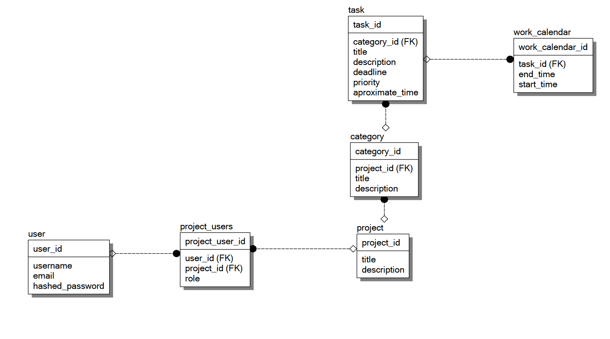

# Что было сделано?

## Задание

Есть следующая архитектура БД:

Мне необходимо заполнить её данными из notion. Данные необходимо получать через
API. При этом запросы к API и добавление данных в БД необходимо распараллелить при 
помощи 3-х подходов:

* asyncio
* threading
* multiprocessing

## Реализация

[ссылка на реализацию через threading](https://github.com/VsevolodKozlov-git/ITMO_ICT_WebDevelopment_tools_2023-2024/tree/lab-2/task2/exercise2/parser_threading)

[ссылка на реализацию через multiprocessing](https://github.com/VsevolodKozlov-git/ITMO_ICT_WebDevelopment_tools_2023-2024/tree/lab-2/task2/exercise2/parse_multiprocessing)

[ссылка на реализацию через asyncio](https://github.com/VsevolodKozlov-git/ITMO_ICT_WebDevelopment_tools_2023-2024/tree/lab-2/task2/exercise2/parser_asyncio)

## Результат

| № попытки              | 1     | 2   | 3   | 
|-----------------------------|-------|-----|-----|
| AsyncIO                     | 5.1   | 3.6 | 4.2 | 
| Threading                   | 2.409 | 3.4 | 3.0 |  
| Multiprocessing(4 процесса) | 8.6   | 9   | 7   |

Видим, что наилучшую производительность показывают AsyncIO и threading. Это
можно объяснить тем, что в нашей задаче не требуется большая вычислительная мощность.
Эта задача требует только ожидания ввода.